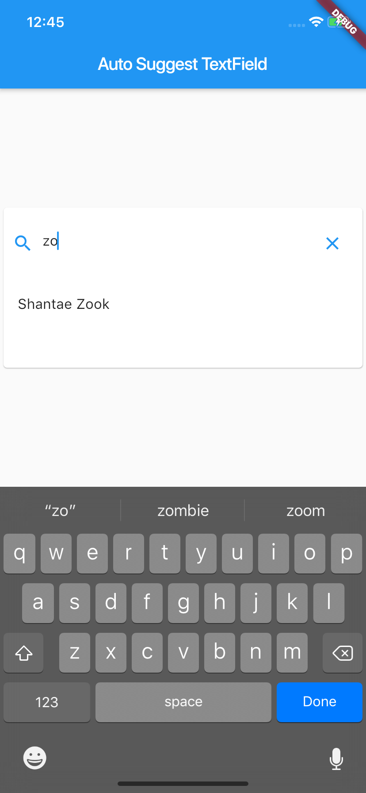

# auto_suggestion_text_field

Auto Suggestion  TextField

## Usage

```dart

class MyHomePage extends StatefulWidget {
  MyHomePage({Key key, this.title}) : super(key: key);

  final String title;

  @override
  _MyHomePageState createState() => _MyHomePageState();
}

class _MyHomePageState extends State<MyHomePage> {
  final _dummySuggestionNames = [
    "Shantae Zook",
    "Sandie Curtis",
    "Kary Janssen",
    "Millard Murray",
    "Rocio Golightly",
    "Cesar Davi",
    "Trinh Eurich",
    "Bethel Roney",
    "Harland Bridgewater",
    "Camie Behr",
    "Cleo Bruck",
    "Alexandra Burgoyne",
    "Debora Crossett",
    "Latina Drye",
    "Palma Guillen",
    "Trenton Burgo",
    "Frankie Sifford",
    "Charley Carboni",
    "Dannielle Pietila",
    "Jenni Hardrick"
  ];

  @override
  Widget build(BuildContext context) {
    final props = TextFieldProperties(
      data: _dummySuggestionNames,
      hint: "Jesse",
      fieldHeight: 90,
      error: "No matching name available",
      onValueSelect: (value) => onSuggestionSelected(value),
    );

    return Scaffold(
      appBar: AppBar(
        title: Text(widget.title),
      ),
      body: Center(
        child: SuggestionTextField(props: props),
      ),
    );
  }

  onSuggestionSelected(String value) => print("Value selected is: $value");
}

```

You can customise the properties of the text field possible properties are listed inside the

```dart
TextFieldProperties
```



